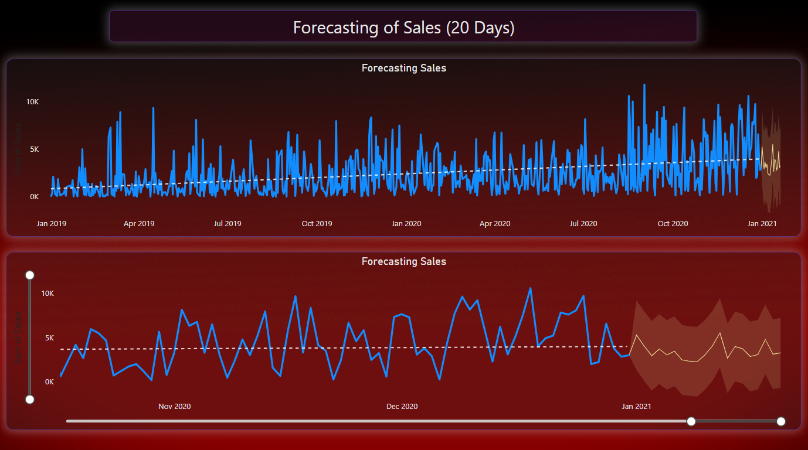
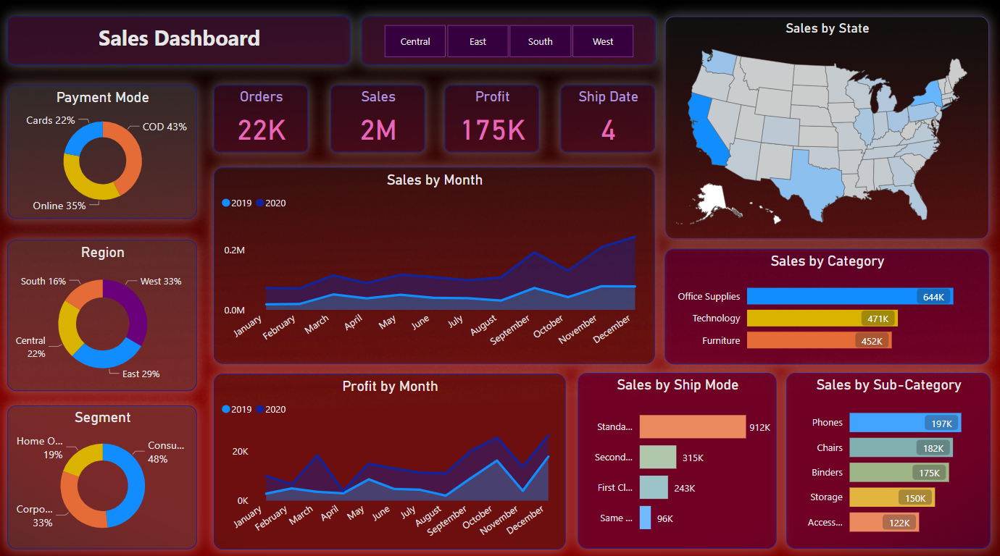

# Analyzing-Sales-Tracking-and-Forecasting-for-a-Superstore-A-Power-BI-Case-Study
This project utilizes Power BI to analyze and forecast sales data from a superstore over a two-year period. We extract, transform, and visualize the data to gain insights into performance and predict future sales. With interactive reports and dashboards, stakeholders can quickly understand trends, make data-driven decisions, improved profitability.

## Introduction:
In today's data-driven business landscape, companies across various industries rely on powerful analytics tools to gain insights and make informed decisions. One such tool is Power BI, a business intelligence platform developed by Microsoft. In this article, we will explore how Power BI can be leveraged to track and forecast sales data for a superstore over a 20-day period, utilizing two years of historical data.

### Understanding Power BI:
Before delving into the specifics of sales tracking and forecasting, let's briefly introduce Power BI. Power BI is a comprehensive suite of business analytics tools that empowers organizations to visualize data, share insights, and make data-driven decisions. It integrates with various data sources, including databases, spreadsheets, and cloud services, to provide users with interactive dashboards and reports.

## Data Preparation:
To begin our analysis, we need to gather the necessary data for the superstore. This includes two years' worth of historical sales data, containing information such as product details, customer demographics, dates, and sales figures. Power BI allows seamless integration with different data sources, making it convenient to import, clean, and transform the data for analysis.

get the data from [data](data/SuperStore_Sales_Dataset.csv) directory.

## Creating Visualizations:
Once the data is imported into Power BI, we can start visualizing it to gain meaningful insights. Sales tracking can be accomplished by creating a variety of visualizations, such as line charts, bar charts, and maps. These visualizations can highlight trends, identify peak sales periods, and uncover patterns in customer behavior. For example, a line chart can show daily sales over the 20-day period, allowing us to identify any significant fluctuations.

## Implementing Forecasting Models:
To forecast future sales, Power BI offers several built-in forecasting models. These models utilize advanced algorithms to analyze historical data and generate predictions. By selecting the appropriate forecasting model and adjusting parameters, we can forecast sales for the upcoming days, enabling the superstore to make proactive decisions related to inventory management, marketing strategies, and resource allocation.

## Interactive Reports and Dashboards:
Power BI's real power lies in its ability to create interactive reports and dashboards. These features enable stakeholders to explore sales data dynamically and gain deeper insights. By adding slicers, filters, and drill-through capabilities, we can empower users to explore specific product categories, customer segments, or geographic regions. Furthermore, the data can be shared securely with key decision-makers, ensuring everyone has access to the latest insights.

## Monitoring and Iteration:
Sales data is dynamic, and it is crucial to continuously monitor and update the analysis. Power BI provides real-time data refresh options, allowing users to stay up to date with the latest sales figures. By regularly evaluating the accuracy of the forecasting models and comparing them with actual sales data, adjustments can be made to improve future predictions.

## Conclusion:
The ability to track and forecast sales accurately is a critical aspect of any business's success. Power BI offers a robust platform to analyze historical sales data, create visualizations, and implement forecasting models for future predictions. By harnessing the power of Power BI, superstores can gain valuable insights, optimize operations, and make data-driven decisions that drive profitability and growth. With its user-friendly interface and extensive capabilities, Power BI is undoubtedly a valuable tool for businesses seeking to extract meaningful insights from their sales data.
